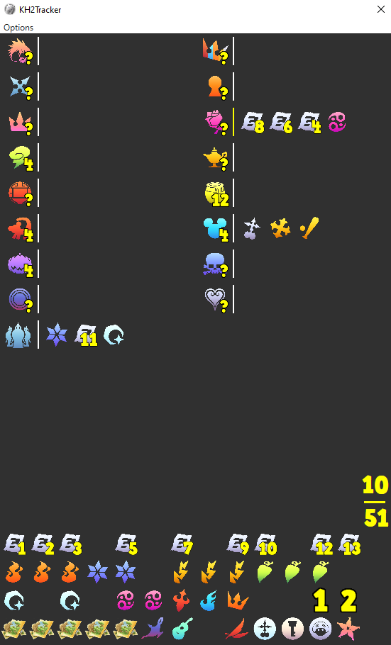

# KH2Tracker
A Kingdom Hearts 2 item tracker for use with the Garden of Assemblage Randomizer mod

## Options

* Reset
  * Resets the tracker to its default state 
* Promise Charm
  * Toggles on/off the promise charm as an important check
  
## How To Use

Highlight Worlds by clicking on them and then click on items to mark them as collected in that world. Clicking on a marked item will return it to the item pool.

The question marks connected to each world can be increased/decreased with the scroll wheel and are used to keep track of a worlds reported hint value. alternatively page up/page down can be used to modify the currently selected worlds hint value.
